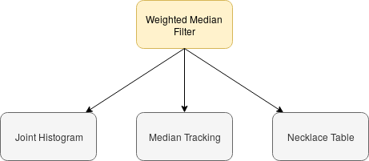
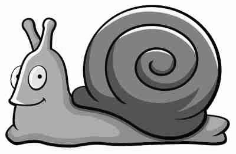
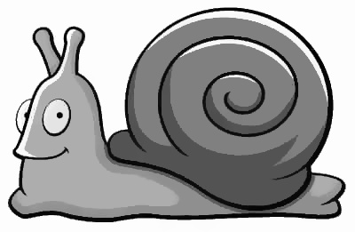
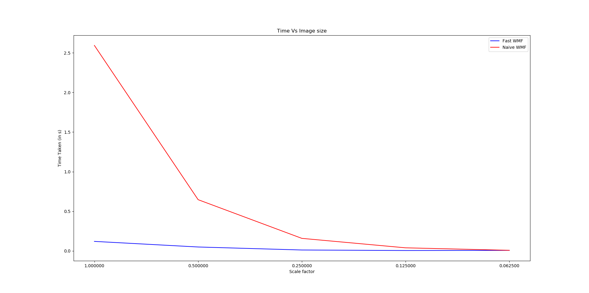
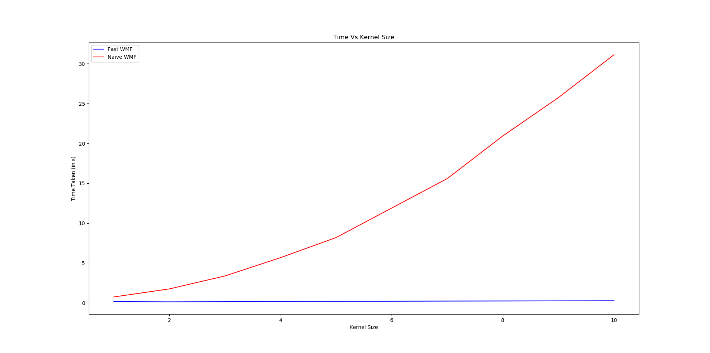
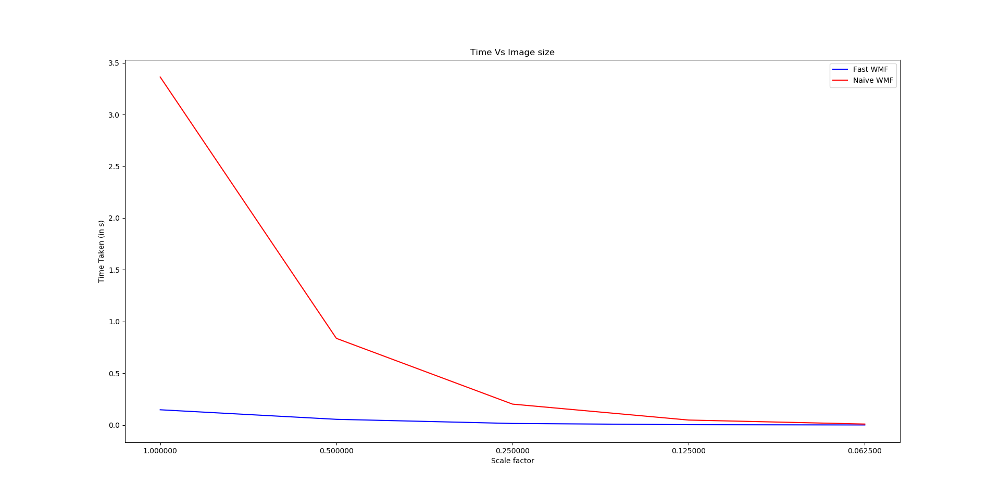

# Fast Weighted Median Filter
Weighted median is used in many of computer vision applications for its  properties in sparsity representation. We re-implement an efficient algorithm to reduce computation complexity from O(r2) to O(r) where r is the kernel size.

The paper contributes a new joint-histogram representation, median tracking, and a new data structure that enables fast data access. The running time is largely shortened from several minutes to less than 1 second.



### Prerequisites

1. **C++11 or higher**: The algorithm scheme is implemented in C++.

2. **GCC compiler**: For compiling C++ code.
> [Install gcc](https://linuxconfig.org/how-to-install-g-the-c-compiler-on-ubuntu-18-04-bionic-beaver-linux)

3. **OpenCV 3.0 or higher**: For image processing tasks.
> [Install opencv](https://www.learnopencv.com/install-opencv3-on-ubuntu/)


### Testing

Please, follow the following instructions for testing the code:

1. Clone this repository
```
git clone https://github.com/gulshan-mittal/Fast-Weighted-Median-Filter.git
```

2. Go to the root directory of the repository.
```
cd Fast-Weighted-Median-Filter
```

3. Compile the files
```
make
```

4. run the output file using the following arguments
```
./output dataset/ComObj/lena.png results/ComObj/lena_out.png 3 0 1
```
Arguments:
- relative image filepath
- output image path
- kernel radius
- type of weights
    - 0: unweighted
    - 1: gaussian
    - 2: Jacard
- comparison with naive implementaion (This argument is not compulsory, you can skip it)
    - 0: Yes
    - 1: No

# Example

```bash
#Kernel size: 3
#Kernel type: Unweighted

./output ./dataset/ComObj/lena.png ./results/ComObj/lena_out.png 3 0
```
Input Image             |  Output image
:-------------------------:|:-------------------------:
  |  


```bash
#Kernel size: 10
#Kernel type: Gaussian

./output ./dataset/Artifacts/snail_artifact.jpg ./results/Artifacts/snail_artifact_out.jpg 10 1
```
Input Image             |  Output image
:-------------------------:|:-------------------------:
  |  


# Analysis

Plot Details            |  Plot
:-------------------------:|:-------------------------:
Time Vs Kernel Size (Gaussian Kernel) |  
Time Vs Image Size (Gaussian Kernel) |  
Time Vs Kernel Size (Unweighted) |  
Time Vs Image Size (Unweighted) |  


## Collaborators

1. [Gulshan Kumar](https://github.com/gulshan-mittal)
2. [Nikhil Bansal](https://github.com/nikhil3456)
3. [Aditya Aggarwal](https://github.com/adityaaggarwal97)
